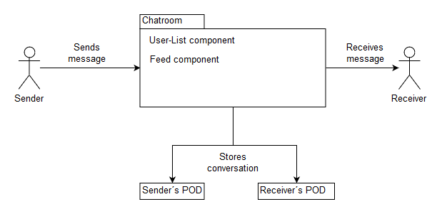
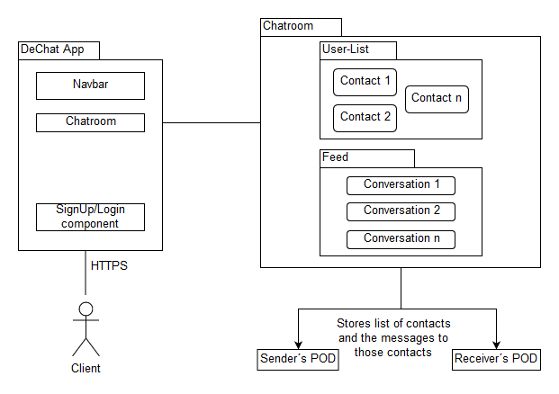

System Scope and Context
========================

Here we will describe the partners involved in the environment of the decentralized chat

Business Context
----------------

### Partners involved:

***Sender/Receiver*** :
Users of the decentralized chat. The sender and the receiver can swap roles, since it´s a conversation, but the sender expects that the message written will be received at some point by the receiver.

***Sender´s/Receiver´s PODs*** : The conversations will be stored in the PODs of the users, as well as the contacts each persons could have. 

Technical Context
-----------------

The chatroom is composed of two main components, a list of users and the feed.

***User-List*** :
Contacts to which the client would want to talk to.

***Feed*** :
Conversations between the client and one of the contacts.

Those components will be stored in the client´s POD.