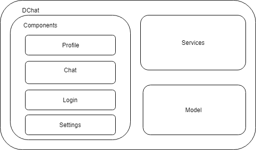

Building Block View
===================

The main structure of this project consist on dividing the chat in a lot of small parts that will be inside a bigger one. 

Some of this parts will be the different components of the application that will contain the files refered to the user interface and some logic related to that component. There is also a folder intended for the logic that manages the whole interaction between components.

Another important part of the structure is the folder containing the domain model of the application.

.png)

**Level 1** 

In the first level we can divide our application in three blocks:

    - Components
    - Service
    - Model

**Level 2** 

In the second level we focus on the components block to differenciate between the four big parts of the web.

    - Chat
    - Profile
    - Login
    - Settings

Each of these parts is divided into many little components. 

Whitebox Overall System
-----------------------

We divided the code in three big blocks to separate the presentation from the logic and the domain.

 

| Block          | Description |
| ---------------- |----------- |
| Components    | In this block we find the presentation of the web. It is also divided into four blocks that covers the whole application: Profile, Chat, Login and Settings. All the elements that form these blocks have a css, ts and html files  |
| Services | This block manages the logic of the application and the comunication between the presentation and the model |
| Model   | The model covers all the entities that are managed by the application |
