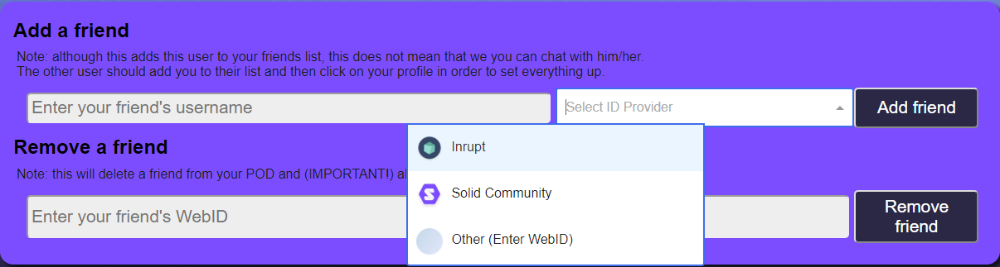
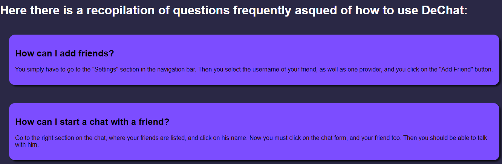
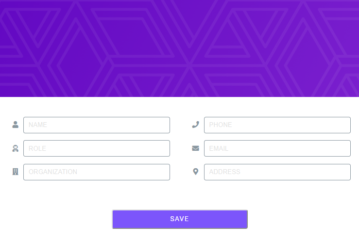

Runtime View 
============

**Contents.**

The view of the application can be divided into four different parts:
- Chat
- Settings
- Help
- Profile

**Chat View**

In the chat view we can find our friends list where we can select the one we want to talk to. To exchange messages with the selected user we have to click on his contact but he also have to add us as a friend and click on ours. If the user tries to send a message to a contact that hasn't added him or hasn't clicked on his contact he will get a message notifying him.

The steps to be able to send messages to a friend are the following: 

1. The user clicks on a friend on his friends list.
2. This creates a folder in the user's pod to store the conversation with that user.
3. The user waits for the user to do the same.
4. When the folders on the corresponding pods are created the conversation is ready

Once the conversation has been opened succesfully, both users can send messages to each other by typing on the textfield at the bottom of the chat and pressing 'Enter' or pressing the button 'Send'. 

The sent messages will contain the name of the sender, the date of the message and the content.

When the user clicks on a conversation that already have messages, he will read the received messages.

**Settings**

In the Settings view we will be able to add and remove friends. 
If we want to add a friend we have to select the provider of his account and write his username. 

If we want to remove a friend, we have to write his card url.

Adding a friend:

1. Write your friend's username in the text field.
2. Open the combobox and select the provider of your friend's account.
3. If the option selected is 'Other', a new text field will appear and you have to write the provider's name.
4. Click on 'Add friend' button.

Removing a friend:

1. Write your friend's card url.
2. Click on the 'Remove' button.

**Help**

This view won't have any functionality but it will suport some usefull information for the user.

**Profile**

The profile view will be oritented to update the user's information. We will be able to update the following fields:

 - Name 
 - Phone
 - Role
 - Email
 - Organization
 - Address

Once the user has already filled the information he has to press the 'Save' button to update the information.

