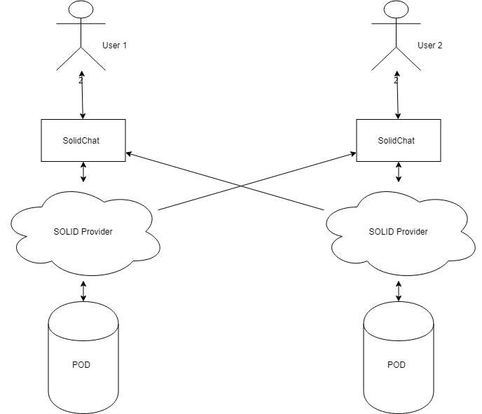

Deployment View 
===============

Since this is a decentralized chat the deployment view is very simple, since it only
focus in interaction between the users and the SOLID providers. Each one of those
elements can not be detailed since they depend on the particular hardware architecture
of the user/provider.

Infrastructure Level 1
----------------------

# Motivation

Comunication the users.

# Quality and/or Performance Features

Depends on both devices, out of our control.

# Mapping of Building Blocks to Infrastructure

There is no posible mapping.