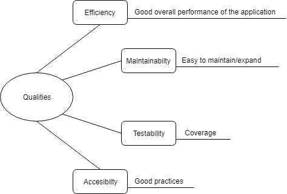

Quality Requirements 
====================

Quality Tree
------------

Quality Scenarios
-----------------

***Testability/Coverage***

By using [Coveralls](https://coveralls.io/) ensure code coverage of at least 80%.

***Maintainabilty***

By using [Codacy](https://www.codacy.com) ensure that the project has at least a "B" mark. Using good practices when coding will make the application easir to mantain.
