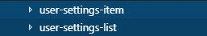
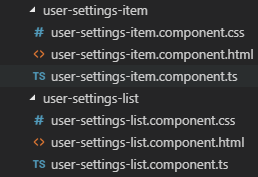
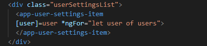
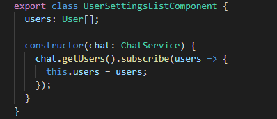
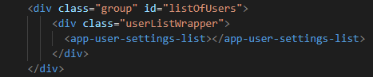

# Changing the Project

The goal of this document is to teach unexperienced developers how to modify the project in orther to extend the functionality.

## Adding a new component
Let's suppose that the new developer wants to add a new component to the chat, for example a list of users on the settings part of the application.

We first have to think about the implementation of the component. We will create a component for the list of users and another one to represent each of the items of the list.

We create a folder for each component.

Now we have to implement the html files to represent both list and items. We will also add a css file to modify the appearance of them and a ts file to implement the behavior.

The next step is adding the items to the list component on the user-setting-list.component.html. 

Now the behavior of the component needs to be added to the ts file in order to show the users in the list.

The list component is ready to be used. The last step is using it on the previously defined settings part, so we add it, like we have already done with the list items, to the settings.component.html file.

